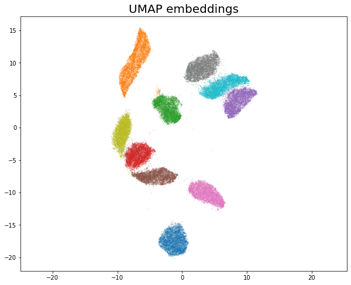

# parametric_umap_pytorch
last update: 14/01/2022

----------
Introduction
----------

This is a simple reproduce of ParametricUMAP based on PyTorch.
I mainly took two sorces for reference, 
[umap library source code](https://arxiv.org/abs/1710.10196) and [parametric_umap tutorial](https://colab.research.google.com/drive/1WkXVZ5pnMrm17m0YgmtoNjM_XHdnE5Vp?usp=sharing#scrollTo=qxcSof65XWKM).

----------
Performance and Examples
----------

### Minist Dataset

  

### Fashion Minist Dataset

  

----------
Citation
----------

    @article {NBC2020,
        author = {Sainburg, Tim and McInnes, Leland and Gentner, Timothy Q.},
        title = {Parametric UMAP: learning embeddings with deep neural networks for representation and semi-supervised learning},
        journal = {ArXiv e-prints},
        archivePrefix = "arXiv",
        eprint = {2009.12981},
        primaryClass = "stat.ML",
        keywords = {Statistics - Machine Learning,
                    Computer Science - Computational Geometry,
                    Computer Science - Learning},
        year = 2020,
        }
